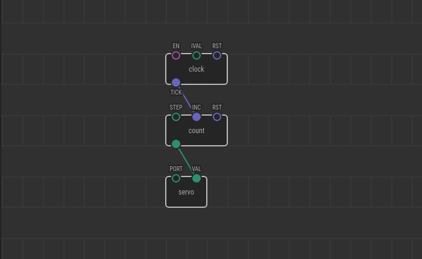
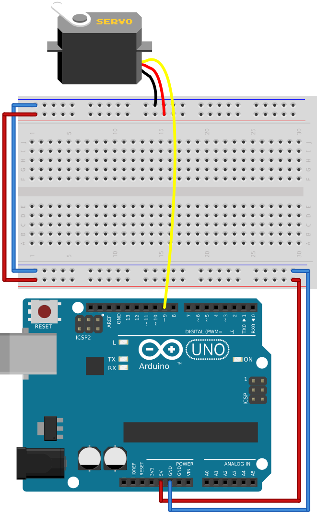

# #23. Pulse Counting

Note
This is a web-version of a tutorial chapter embedded right into the XOD IDE.
To get a better learning experience we recommend to install the
<a href="/downloads/">desktop IDE</a> or start the
<a href="/ide/">browser-based IDE</a>, and you’ll see the same tutorial there.

Let’s make a funky wall clock. We now have all we need to do this.

The clock will be the servo. Using the `count` node, we will change the degree
of its rotation from 0° to 180° in one minute.

The `count` node works as a simple counter. Each time it receives a pulse, it
increases the number that it gives out, in increments of the `STEP` pin.

## Test circuit

[↓ Download as a Fritzing project](./circuit.fzz)

## How-to

1. In the `clock` node, set the value of `IVAL` to `1` second.
2. In the `count` node, set `STEP` to `0.017`. This means that every time the
   pulse arrives on the `INC` pin (in our case, once per second), the node will
   increase the number on the output by 0.017. For the servo node, this is
   approximately 3°.
3. Upload the patch to the Arduino.

You will see that the servo is “ticking” every second. In one minute, it will
reach 180°. The `count` node works as a simple counter. Each time it receives a
pulse, it increases the number that it gives out, in increments of the `STEP`
pin

[Next lesson →](../24-flip-flop/)
