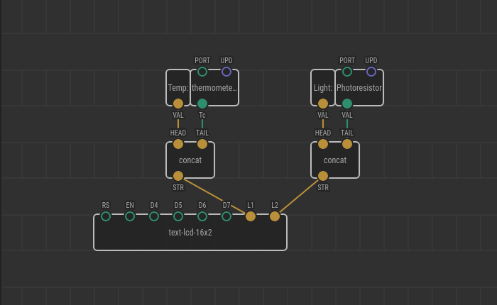
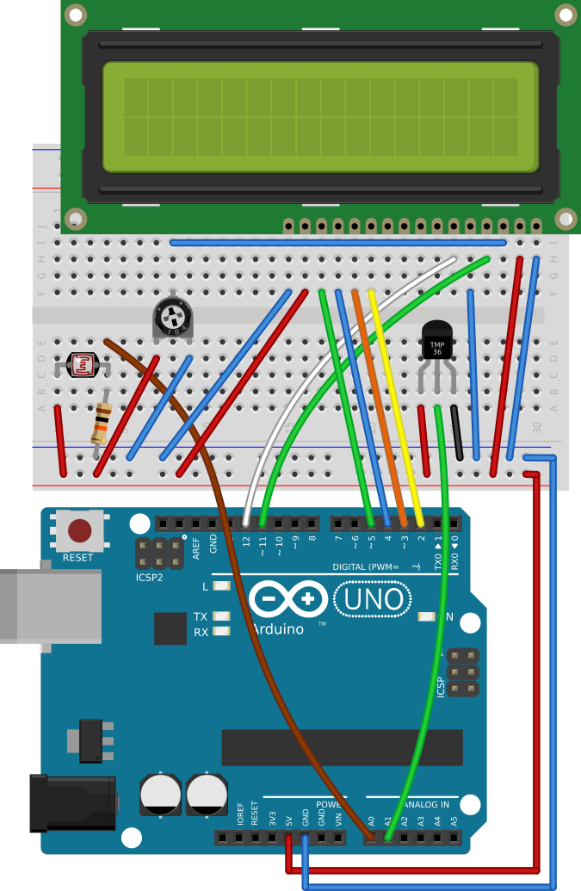
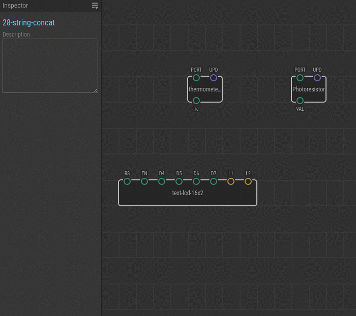

# #28. String Concatenation

We have already learned how to display readings from our sensors. But if we
have more than one sensor, we'll need a way to tell the readings apart.

The `concat` node will help us solve this problem.

Concat allows you to merge two strings into one. The new string will have the
input to the `HEAD` pin placed in the beginning and the input to the `TAIL` pin
placed at the end.

## Test circuit

[↓ Download as a Fritzing project](./circuit.fzz)

## How-to

1. Find the `constant-string` node in the library. Add one per string that
   never change. Alternatively, bind the desired value directly to a `concat`
   pin via Inspector.
2. Assign string values to each node using the Inspector. Try something like
   “Temp: ” and “Light: ” to keep things short. Put a space at the end
   so that when we combine it with another string they won't bunch up.
3. Link the `VAL` pins of the `constant-string` nodes to the `HEAD` pins of the
   `concat` nodes. `HEAD` is the beginning of the line, it’s the first part.
4. Link the outputs of the thermometer and photoresistor to the `TAIL` pins on
   the `concat` nodes. They will be the second part of the generated string.
5. Upload the patch to the Arduino.

Now, the readings from your sensors are displayed on the screen with a
convenient label!

## Try it yourself

Try to display the measurement label before the reading and the units of
measurement afterward. Use two more `concat` nodes for this. But remember, you
only have 16 characters per line.

Try to convert degrees Celsius to degrees Fahrenheit and label them accordingly.
You will find a clue for this task in [chapter #14](../14-map-adjust/).
